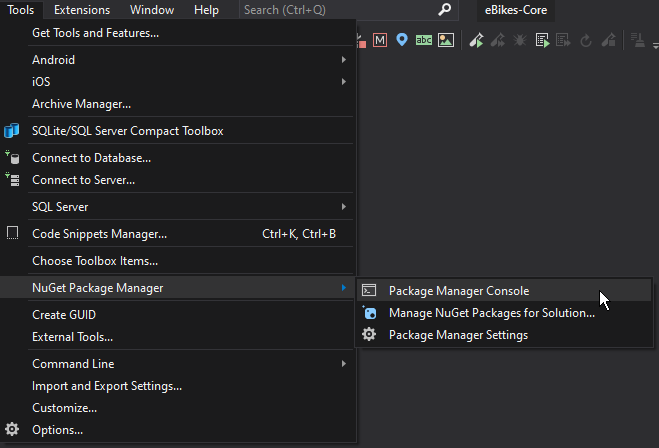
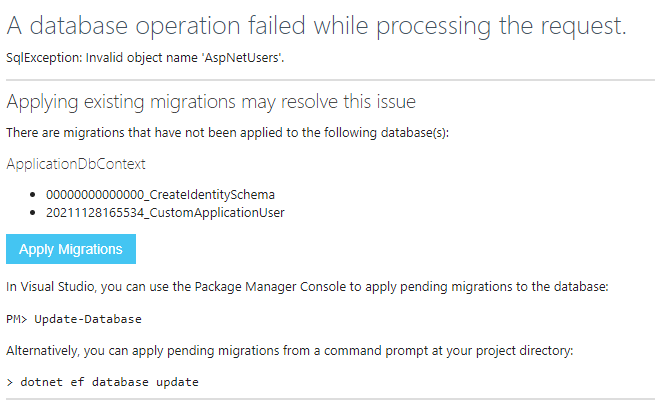
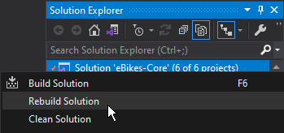
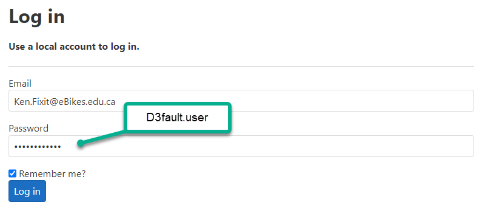

# Security Setup

> ***Note:** Due to the shortened time frame in this semester, we are providing you with the following guide to set up the security component for your group project.*
>
> **Follow these instructions carefully.**

## Step 1 - Project Setup

Create a new **class library** project called "AppSecurity". In it, reverse engineer a single table from the database: `Employees`.

Define an interface that will represent a common set of properties represented by the database's `Employees` and the desired users for our website.

```csharp
public interface IIdentifyEmployee
{
    int? EmployeeId { get; set; }
    string UserName { get; set; }
    string Email { get; set; }
}
```

Then create a query model of the staff member.

```csharp
public class StaffMember : IIdentifyEmployee
{
    public int? EmployeeId { get; set; }
    public string UserName { get; set; }
    public string Email { get; set; }
}
```

Define a service to provide security information for your application.

```csharp
public class SecurityService
{
    private readonly AppSecurityDbContext _context;

    internal SecurityService(AppSecurityDbContext context)
    {
        _context = context;
    }

    public List<IIdentifyEmployee> ListEmployees()
    {
        var people = from emp in _context.Employees
                        select new StaffMember
                        {
                            EmployeeId = emp.EmployeeId,
                            Email = $"{emp.FirstName}.{emp.LastName}@eBikes.edu.ca",
                            // NOTE: UserName as an email to match the default login page
                            UserName = $"{emp.FirstName}.{emp.LastName}@eBikes.edu.ca"
                            //UserName = $"{emp.FirstName}.{emp.LastName}" // Alternative
                        };
        return people.ToList<IIdentifyEmployee>();
    }

    public string GetEmployeeName(int employeeId)
    {
        string result = "";
        var found = _context.Employees.Find(employeeId);
        if (found != null)
            result = $"{found.FirstName} {found.LastName}";
        return result;
    }
}
```

Set up the start-up extension class needed for configuring the dependency injection for this library. Note that the method name in this extension class must be different from the one used in your other class library projects. Be sure to call this method in the startup configuration of your web application project.

## Web Application Modifications

We want to support a connection between our built-in employees in the eBikes database with the provided security code that was generated when we chose *Individual User Account* in creating our web application project. To do that, we will be adding new files as well as modifying existing code that was generated for us.

Under the *Data/* folder, add the following class. This will represent the customized user type for login accounts. Note how this class also implements the `IIdentifyEmployee` interface from our class library above.

```csharp
public class ApplicationUser : IdentityUser, IIdentifyEmployee
{
    public int? EmployeeId { get; set; }
}
```

Now, modify the `ApplicationDbContext` class so that it inherits from `IdentityDbContext<ApplicationUser>`.

```csharp
public class ApplicationDbContext : IdentityDbContext<ApplicationUser>
{
    public ApplicationDbContext(DbContextOptions<ApplicationDbContext> options)
        : base(options)
    {
    }
}
```

Modify the `_LoginPartial.cshtml` shared file to replace the `IdentityUser` with the new `ApplicationUser` in the first few lines. The start of your file should look like this.

```razor
@using Microsoft.AspNetCore.Identity
@inject SignInManager<ApplicationUser> SignInManager
@inject UserManager<ApplicationUser> UserManager
```

Make a similar change from `IdentityUser` to `ApplicationUser` in the `ConfigureServices()` method of the `Startup.cs` file.

```csharp
services.AddDefaultIdentity<ApplicationUser>(options => options.SignIn.RequireConfirmedAccount = true)
    .AddEntityFrameworkStores<ApplicationDbContext>();
```

The `Program` class in the `Program.cs` file will have to be modified with the following. This new code will **seed the **database**** with our existing employees as users that can now log in.

Replace the last line of the `Program.cs` file (the one that has `app.Run()`) with the following.

```csharp
await ApplicationUserSeeding(app);
app.Run();

private static async Task ApplicationUserSeeding(IHost host)
{
    using (var scope = host.Services.CreateScope())
    {
        var services = scope.ServiceProvider;
        var loggerFactory = services.GetRequiredService<ILoggerFactory>();
        var logger = loggerFactory.CreateLogger<Program>();
        var env = services.GetRequiredService<IWebHostEnvironment>();
        if (env is not null && env.IsDevelopment())
        {
            try
            {
                var configuration = services.GetRequiredService<IConfiguration>();
                var userManager = services.GetRequiredService<UserManager<ApplicationUser>>();
                if (!userManager.Users.Any())
                {
                    var securityService = services.GetRequiredService<SecurityService>();
                    var users = securityService.ListEmployees();
                    string password = configuration.GetValue<string>("Setup:InitialPassword");
                    foreach (var person in users)
                    {
                        var user = new ApplicationUser
                        {
                            UserName = person.UserName, 
                            Email = person.Email,
                            EmployeeId = person.EmployeeId,
                            EmailConfirmed = true
                        };
                        var result = await userManager.CreateAsync(user, password);
                        if (!result.Succeeded)
                        {
                            logger.LogInformation("User was not created");
                        }
                    }
                }
            }
            catch (Exception ex)
            {
                logger.LogWarning(ex, "An error occurred seeing the website users");
            }
        }
    }
}
```


Ensure that your **user secrets** file has the following information. Essentially, you must use the same eBike database for the `"DefaultConnection"`. You are also setting up an initial password to be used when seeding the database users.

```json
{
  "ConnectionStrings": {
    "DefaultConnection": 
      "Data Source=.;Initial Catalog=eBikes;Integrated Security=True;MultipleActiveResultSets=true;"
  },
  "Setup": {
    "InitialPassword": "D3fault.user"
  }
}
```

From the Tools menu, open the Package Manager Console.

> 

In the console, run the following command. It will create a new class whose filename includes a time-stamp of when the file was created.

```shell
Add-Migration CustomApplicationUser -Context ApplicationDbContext
```

Take a look at that file. It should include `Up()` and `Down()` methods with information on the new properties for the `AspNetUsers` table.

```csharp
protected override void Up(MigrationBuilder migrationBuilder)
{
    migrationBuilder.AddColumn<int>(
        name: "EmployeeId",
        table: "AspNetUsers",
        type: "int",
        nullable: true);
}
```

```csharp
protected override void Down(MigrationBuilder migrationBuilder)
{
    migrationBuilder.DropColumn(
        name: "EmployeeId",
        table: "AspNetUsers");
}
```

Now you can run your application and attempt a login. It doesn't matter what credentials you enter, as we are simply triggering the automatic generation of the database tables. You should see a screen similar to the following.

> 

Click the **[Apply Migrations]** button. At this point the database tables will be generated, *but the users will not yet be seeded*. To seed the database, you will need to do a re-build of your solution and then re-run the application (<kbd>Ctrl</kbd> + <kbd>F5</kbd>).

> 

Now you can test the login with an actual user to see if everything is working well.




## Requiring Authorization

Finally, you can apply authorization requirements to your subsystem folders by modifying the line that adds Razor Pages services in the `Program.cs` file. Replace the line `builder.Services.AddRazorPages();` with the following to specify authorization for each subsystem's folders. Adjust as necessary for whichever subsystems are being used in your project.

```csharp
builder.services.AddRazorPages(options =>
{
    options.Conventions.AuthorizeFolder("/Purchasing")
        .AllowAnonymousToPage("/Purchasing/Index");
    options.Conventions.AuthorizeFolder("/Receiving")
        .AllowAnonymousToPage("/Receiving/Index");
    options.Conventions.AuthorizeFolder("/Sales")
        .AllowAnonymousToPage("/Sales/Index");
    options.Conventions.AuthorizeFolder("/Servicing")
        .AllowAnonymousToPage("/Servicing/Index");
});
```

Whenever a user attempts to visit a subsystem page other than the default one, they will need to be logged in. If they are not logged in, they will be redirected to the login page.

Once they are logged in, you can get the user information via various services, as demonstrated in this example. This is useful, as you may need to know the user's Employee Id for some of your processing.

```csharp
namespace WebApp.Pages.Sales
{
    public class SalesReturnsModel : PageModel
    {
        private readonly UserManager<ApplicationUser> _UserManager;
        private readonly SecurityService _Security;

        public SalesReturnsModel(UserManager<ApplicationUser> userManager, SecurityService security)
        {
            _UserManager = userManager;
            _Security = security;
        }

        public ApplicationUser AppUser { get; set; }
        public string EmployeeName { get; set; }
        public async Task OnGet()
        {
            AppUser = await _UserManager.FindByNameAsync(User.Identity.Name);
            EmployeeName = _Security.GetEmployeeName(AppUser.EmployeeId.Value);
        }

        // ... other code
    }
}
```

> ***Questions/Comments?** If you find any mistakes in these instructions or would like clarification on any of the items, please contact your instructor.*

*Back to the [General Instructions](./../README.md)*
