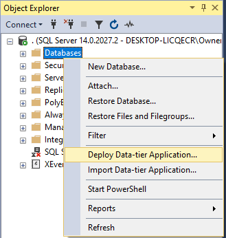

# Installing The eBikes Database 

> Check the `DatabaseVersion` table for the version number - it should be **`1.1.0`**

The [eBike_DMIT2018.dacpac](./eBike_DMIT2018.dacpac) has been provided for you to install the database. Using Sql Server Management Studio (SSMS), simply right-click on *Databases* in the *Object Explorer* and choose "Deploy Data-tier Application...", then follow the instructions in the dialog.

*Back to the [General Instructions](./../README.md)*
