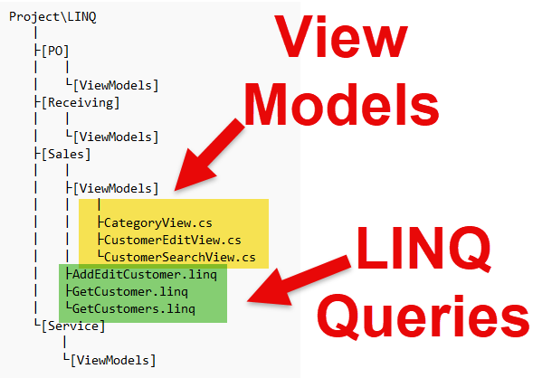
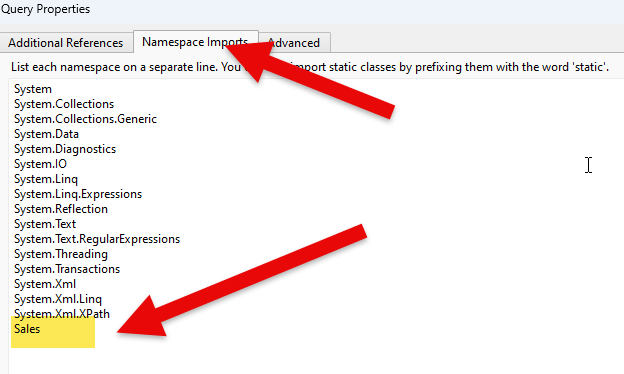

# Deliverable 1 - **Transactional Service Methods**

This deliverable requires that you create working solution(s) for your query and transactional service methods using Linqpad. Test the service method(s). **Each** method should be coded in it own Linqpad Program environment file. Once you have a working query or transactional method, implementation the method in your class library subsystem.

The folder structure for your LINQ files should be the following:  


> ***NOTE:*** Compiler errors that prevent the project from loading may be treated as an automatic mark of zero for this section.

Be sure to develop your solution in small increments, making frequent commits and referencing your issue numbers from GitHub.

Your Linqpad solution should:

### Query method

1. a query displaying the data 
1. use either the data models provide or your own
1. use the Main method as the driver for testing
1. place the service in it's own appropriate method
   
### Transaction method

1. contain user friendly error handling 
1. a query(ies) displaying the data manipulated by the service method transaction
1. use of the data models provide or your own
1. use the Main method as the driver for testing
1. place the service in it's own appropriate method

**Use your class demonstrations in accomplishing this task.** You may discover issues with your original Planning document. **DO NOT** alter your original comments of your plan. Create **new** comments within your Planning document issue to track any changes to your original plan.

----

# Referencing Your View Model From LINQ Query
1. Add a reference to your "View Model" folder at the top of your LINQ query.
```csharp
//  add a reference to all models
//  NOTE:  You need an absolute path for this.
#load "C:\tmp\LINQ\Sales\ViewModels\*.cs /s"
using Sales;
void main
{
    
}

//	get customer
public CustomerEditView AddEditCustomer(CustomerEditView editCustomerView)
{

//  reference the GetCustomer LINQ Query found in the current folder
return GetCustomer(customerEditView.CustomerID)
}
```

2. Add a reference to the name space within your model
* Press F4
* Click on Namespace Imports
* Add the Namespace name to the list




3. Add a name space to your model.  **NOTE:  When you copy in your view model into your library, you will have to update the name space**
```csharp
namespace Sales
{
    public class CustomerEditView
    {
        public int CustomerID { get; set; }
        public string FirstName { get; set; }
        public string LastName { get; set; }
        public string Address1 { get; set; }
        public string Address2 { get; set; }
        public string City { get; set; }
        public int ProvStateID { get; set; }
        public int CountryID { get; set; }
        public string PostalCode { get; set; }
        public string Phone { get; set; }
        public string Email { get; set; }
        public int StatusID { get; set; }
        public bool RemoveFromViewFlag { get; set; }
    }
}
```
4.  You now have access to calling your external LINQ queries


```


*Back to the [General Instructions](./README.md)*
