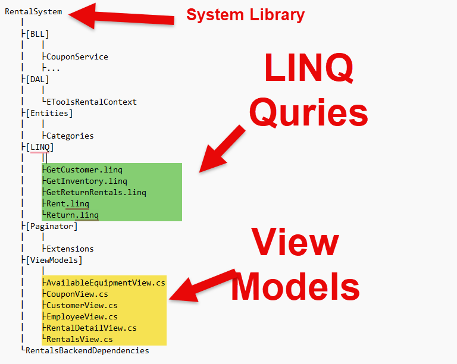
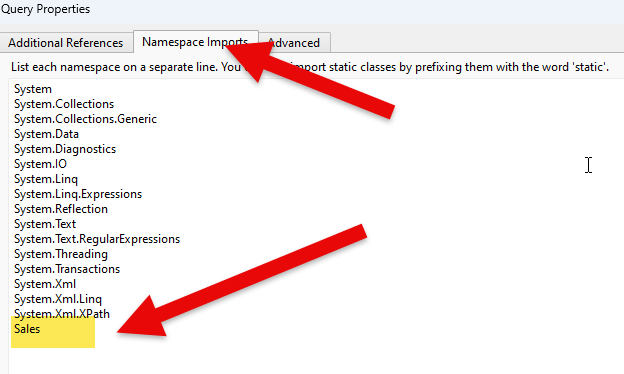
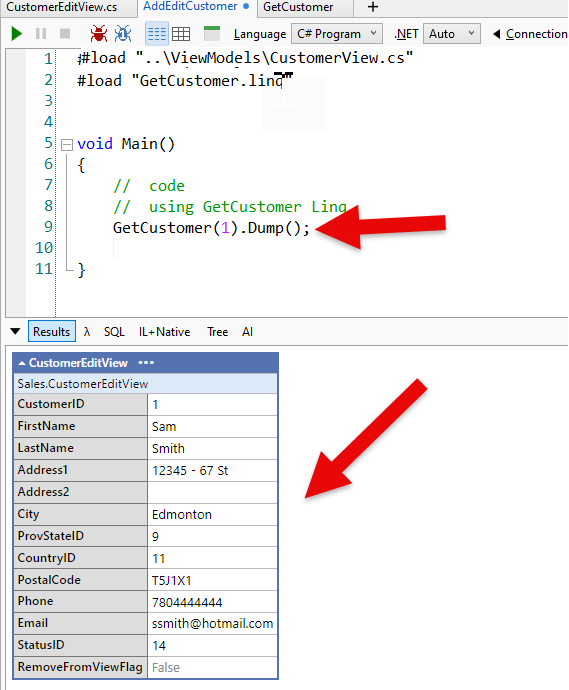

# Deliverable 1 - **Transactional Service Methods**

This deliverable requires that you create working solution(s) for your query and transactional service methods using Linqpad. Test the service method(s). **Each** method should be coded in it own Linqpad Program environment file. Once you have a working query or transactional method, implementation the method in your class library subsystem.

The folder structure for your LINQ files should be the following:  


> ***NOTE:*** Compiler errors that prevent the project from loading may be treated as an automatic mark of zero for this section.

Be sure to develop your solution in small increments, making frequent commits and referencing your issue numbers from GitHub.

Your Linqpad solution should:

### Query method (See bottom of document for full examples of requirements)

1. a query displaying the data 
1. use either the data models provide or your own
1. use the Main method as the driver for testing
1. place the service in it's own appropriate method
   
### Transaction method (See bottom of document for full examples of requirements)

1. contain user friendly error handling 
1. a query(ies) displaying the data manipulated by the service method transaction
1. use of the data models provide or your own
1. use the Main method as the driver for testing
1. place the service in it's own appropriate method

**Use your class demonstrations in accomplishing this task.** You may discover issues with your original Planning document. **DO NOT** alter your original comments of your plan. Create **new** comments within your Planning document issue to track any changes to your original plan.

----

# Referencing Your View Model From LINQ Query
1. Add a reference to your "View Model" folder at the top of your LINQ query.
```csharp
//  add a reference to all models
//  NOTE:  You need an absolute path for this.
#load "C:\tmp\LINQ\Sales\ViewModels\*.cs /s"
using Sales;
void main
{
    
}

//	get customer
public CustomerEditView AddEditCustomer(CustomerEditView editCustomerView)
{

//  reference the GetCustomer LINQ Query found in the current folder
return GetCustomer(customerEditView.CustomerID)
}
```

2. Add a reference to the name space within your model
* Press F4
* Click on Namespace Imports
* Add the Namespace name to the list




3. Add a name space to your model.  **NOTE:  When you copy in your view model into your library, you will have to update the name space**
```csharp
namespace Sales
{
    public class CustomerEditView
    {
        public int CustomerID { get; set; }
        public string FirstName { get; set; }
        public string LastName { get; set; }
        public string Address1 { get; set; }
        public string Address2 { get; set; }
        public string City { get; set; }
        public int ProvStateID { get; set; }
        public int CountryID { get; set; }
        public string PostalCode { get; set; }
        public string Phone { get; set; }
        public string Email { get; set; }
        public int StatusID { get; set; }
        public bool RemoveFromViewFlag { get; set; }
    }
}
```

4.  You now have access to calling your external LINQ queries


---

# Query & Transaction Method Examples
For all of your of your queries, you have an option of showing failing business rules if there is only one business rule. If your driver has more than one business rules causing the driver to halt, then you must comment out any test data. Please review the examples below.  
### All examples are from the Hogwild database.
## Customer View Models
```csharp
 //  View Model for Customer Search
 //  required to allow access the GetCustomers method
namespace HogWildSystem
{
    public class CustomerSearchView
    {
        public int CustomerID { get; set; }
        public string FirstName { get; set; }
        public string LastName { get; set; }
        public string City { get; set; }
        public string Phone { get; set; }
        public string Email { get; set; }
        public int StatusID { get; set; }
    }
}

//  View Model for Customer Add/Edit
//  required to allow access the GetCustomer/AddEditCustomer method
namespace HogWildSystem
{    
  public class CustomerEditView
    {
        public int CustomerID { get; set; }
        public string FirstName { get; set; }
        public string LastName { get; set; }
        public string Address1 { get; set; }
        public string Address2 { get; set; }
        public string City { get; set; }
        public int ProvStateID { get; set; }
        public int CountryID { get; set; }
        public string PostalCode { get; set; }
        public string Phone { get; set; }
        public string Email { get; set; }
        public int StatusID { get; set; }
        public bool RemoveFromViewFlag { get; set; }
    }
}
```
## Unit Test Helper Class
### A static class with methods for generating test data and GetInnerException method.
```csharp
/// <summary>
/// Helper class containing utility methods primarily intended for generating test data.
/// </summary>
using System;
namespace HogWildSystem
{
	public static class UnitTestHelper
	{
		/// <summary>
		/// Generates a random name of a given length.
		/// The generated name follows a pattern of alternating consonants and vowels.
		/// </summary>
		/// <param name="len">The desired length of the generated name.</param>
		/// <returns>A random name of the specified length.</returns>
		public static string GenerateName(int len)
		{
			// Create a new Random instance.
			Random r = new Random();

			// Define consonants and vowels to use in the name generation.
			string[] consonants = { "b", "c", "d", "f", "g", "h", "j", "k", "l", "m", "l", "n", "p", "q", "r", "s", "sh", "zh", "t", "v", "w", "x" };
			string[] vowels = { "a", "e", "i", "o", "u", "ae", "y" };

			string Name = "";

			// Start the name with an uppercase consonant and a vowel.
			Name += consonants[r.Next(consonants.Length)].ToUpper();
			Name += vowels[r.Next(vowels.Length)];

			// Counter for tracking the number of characters added.
			int b = 2;

			// Add alternating consonants and vowels until we reach the desired length.
			while (b < len)
			{
				Name += consonants[r.Next(consonants.Length)];
				b++;
				Name += vowels[r.Next(vowels.Length)];
				b++;
			}

			return Name;
		}

		/// <summary>
		/// Generates a random phone number.
		/// The generated phone number ensures the first digit is not 0 or 1.
		/// </summary>
		/// <returns>A random phone number.</returns>
		public static string RandomPhoneNumber()
		{
			var random = new Random();
			string phoneNumber = string.Empty;

			// Iterate until we generate an 11-digit phone number.
			while (phoneNumber.Length < 11)
			{
				int currentDigit = random.Next(10);

				// Ensure the first digit isn't 0 or 1.
				if (phoneNumber.Length == 0 && currentDigit > 1)
				{
					phoneNumber = $"{phoneNumber}{currentDigit}";
				}
				else
				{
					if (phoneNumber.Length > 0 && currentDigit > 1)
					{
						phoneNumber = $"{phoneNumber}{currentDigit}";
					}
				}
			}

			return phoneNumber;
		}

		/// <summary>
		/// Generates an email address using the provided first name, last name,
		///   and a random domain name.
		/// </summary>
		/// <param name="firstName">The first name to use in the email address.</param>
		/// <param name="lastName">The last name to use in the email address.</param>
		/// <returns>An email address in the format [firstName].[lastName]@[randomDomain].com</returns>
		public static string GetEmailAddress(string firstName, string lastName)
		{
			// Generate an email in the format: firstname.lastname@randomDomain.com
			return $"{firstName.ToLower()}.{lastName.ToLower()}@{GenerateName(7).ToLower()}.com";
		}

		//	Gets the Exception instance that caused the current exception.
		//	An object that describes the error that caused the current exception.
		public static Exception GetInnerException(System.Exception ex)
		{
			while (ex.InnerException != null)
				ex = ex.InnerException;
			return ex;
		}
	}
}
```
## Query method


You are task with working with the customer information.  You must create 2 queries for retrieving customer(s) data and 1 command/OLTP method for adding a new customer and editing an existing customer.

### Requirements/Rules
* Customer Search
  * When searching for a list of customers, you must provided a **partial last name**.
  * If no customer are found, you must raise an error stating "No customer found with that search criteria".
* Retrieving Individual Customer
  * A customer ID is required. If customer ID is provided, we will assume that the customer exist in the database.
  
##  Customer Search (GetCustomers Method)
```csharp
// reference to view model
#load ".\CustomerSearchView.cs"
//	helper class for generating test data & GetInnerException method
#load ".\UnitTestHelper.cs"
//required to access the CustomerSearchView view model
using HogWildSystem;

void Main()
{
    try
    {
        //  get valid data
        string lastName = "Fo";
        GetCustomers(lastName).Dump();

        // testing business rule (last name is required)
        Console.WriteLine("");
        Console.WriteLine("Last name is required");
        lastName = string.Empty; ;
        GetCustomers(lastName).Dump();
    }
    #region  catch all exceptions
    catch (AggregateException ex)
    {
        foreach (var error in ex.InnerExceptions)
        {
            error.Message.Dump();
        }
    }

    catch (ArgumentNullException ex)
    {
        UnitTestHelper.GetInnerException(ex).Message.Dump();
    }

    catch (Exception ex)
    {
        UnitTestHelper.GetInnerException(ex).Message.Dump();
    }
    #endregion
}

//	get customers
public List<CustomerSearchView> GetCustomers(string lastName)
{
    //  Business Rules
    //	These are processing rules that need to be satisfied
    //		for valid data
    //		rule:	last name cannot be empty
    //		rule: 	RemoveFromViewFlag must be false

    if (string.IsNullOrWhiteSpace(lastName))
    {
        throw new ArgumentNullException("Please provide a last name");
    }

    //  return customers that meet our criteria
    return Customers
            .Where(x => x.LastName.Contains(lastName)
                    && !x.RemoveFromViewFlag)
            .Select(x => new CustomerSearchView
            {
                CustomerID = x.CustomerID,
                FirstName = x.FirstName,
                LastName = x.LastName,
                City = x.City,
                Phone = x.Phone,
                Email = x.Email,
                StatusID = x.StatusID
            }).OrderBy(x => x.LastName)
            .ToList();
}

```

##  Get Customer Record (GetCustomer Method)
```csharp
// reference to view model
#load ".\CustomerEditView.cs"
//	helper class for generating test data & GetInnerException method
#load ".\UnitTestHelper.cs"
//required to access the CustomerSearchView view model
using HogWildSystem;

void Main()
{
    try
    {
        //  get valid data
        int customerID = 6;
        GetCustomer(customerID).Dump();

        // testing business rule (customer ID is required)
        customerID = 0;
        Console.WriteLine("");
        Console.WriteLine("Customer ID is required");
        GetCustomer(customerID).Dump();
    }
    #region  catch all exceptions
    catch (AggregateException ex)
    {
        foreach (var error in ex.InnerExceptions)
        {
            error.Message.Dump();
        }
    }

    catch (ArgumentNullException ex)
    {
        UnitTestHelper.GetInnerException(ex).Message.Dump();
    }

    catch (Exception ex)
    {
        UnitTestHelper.GetInnerException(ex).Message.Dump();
    }
    #endregion
}


//	get customer
public CustomerEditView GetCustomer(int customerID)
{
    //  Business Rules
    //	These are processing rules that need to be satisfied
    //		for valid data
    //		rule:	customerID must be valid 
    //		rule: 	RemoveFromViewFlag must be false

    if (customerID == 0)
    {
        throw new ArgumentNullException("Please provide a customer ID");
    }

    return Customers
        .Where(x => (x.CustomerID == customerID
                     && x.RemoveFromViewFlag == false))
        .Select(x => new CustomerEditView
        {
            CustomerID = x.CustomerID,
            FirstName = x.FirstName,
            LastName = x.LastName,
            Address1 = x.Address1,
            Address2 = x.Address2,
            City = x.City,
            ProvStateID = x.ProvStateID,
            CountryID = x.CountryID,
            PostalCode = x.PostalCode,
            Phone = x.Phone,
            Email = x.Email,
            StatusID = x.StatusID,
            RemoveFromViewFlag = x.RemoveFromViewFlag
        }).FirstOrDefault();
}
```
---
## Transaction method  
### Requirements/Rules
* Adding a new customer
  * First name, last name, phone number and email are required (not empty)
  * A customer cannot already exist in the database (same first name, last name, phone number & email).
* Editing a new customer
  * First name, last name, phone number and email are required (not empty)
### NOTE:  The code includes a references to UnitTestHelper which has methods for generating a new name, phone number and email address for you.
```csharp
//  reference to view model
#load ".\CustomerEditView.cs"
//  reference the get customer method
#load ".\GetCustomer"
//	helper class for generating test data & GetInnerException method
#load ".\UnitTestHelper.cs"

//required to access the CustomerEditView view model
using HogWildSystem;
void Main()
{
	try
	{
		#region Creating a new record
		//  current record counts
		int totalRecords = Customers.Count();
		//  showing record count before adding a new customer
		Console.WriteLine($"Record count before adding new customer: {totalRecords}");
		//  create test data that will be reuse later
		string firstName = UnitTestHelper.GenerateName(5);
		string lastName = UnitTestHelper.GenerateName(10);
		string email = UnitTestHelper.GetEmailAddress(firstName, lastName);
		string phone = UnitTestHelper.RandomPhoneNumber();

		//	create a new customer edit view model
		CustomerEditView beforeAdd = new CustomerEditView()
		{
			FirstName = firstName,
			LastName = lastName,
			Address1 = "123 Main St.",
			Address2 = "South of Flag Pole",
			City = "Edmonton",
			ProvStateID = 9,    //  Alberta
			CountryID = 11,     //	Canada
			PostalCode = "T0A1A2",
			Email = email,
			Phone = phone,
			StatusID = 14,       //	Bronze						
			RemoveFromViewFlag = false
		};

		//	add a new customer
		CustomerEditView afterAdd = AddEditCustomer(beforeAdd);

		//  new record count
		totalRecords = Customers.Count();
		//  showing record count and customer after adding a new customer
		Console.WriteLine($"Record count after adding new customer: {totalRecords}");
		afterAdd.Dump();
		#endregion Creating a new record

		#region Updating an existing record
		//  showing that postal code has changed
		//	NOTE: you do not need to show the record before hand as
		//			we are reusing the previous new record
		afterAdd.PostalCode = "A0B1C2";
		CustomerEditView afterEdit = AddEditCustomer(afterAdd);

		//	validating that the postal code has changed
		afterEdit.Dump();
		#endregion Updating an existing record

		#region Checking rules (reusing existing data)
		//  we will be reusing the before add view models for testing
		//  NOTE:	You only need to comment out the call to the methods.  
		//			You do not need to comment out the Console.WriteLine

		//	first name is required
		beforeAdd.FirstName = string.Empty;
		Console.WriteLine("");
		Console.WriteLine("First name is required");
		//AddEditCustomer(beforeAdd);
		//	resetting first name
		beforeAdd.FirstName = firstName;

		//	last name is required
		Console.WriteLine("");
		Console.WriteLine("Last name is required");
		//AddEditCustomer(beforeAdd);
		//	resetting last name
		beforeAdd.LastName = lastName;

		//	phone is required
		Console.WriteLine("");
		Console.WriteLine("Phone number is required");
		//AddEditCustomer(beforeAdd);
		//	resetting phone
		beforeAdd.Phone = phone;

		//	email is required
		Console.WriteLine("");
		Console.WriteLine("Email is required");
		//AddEditCustomer(beforeAdd);
		//	resetting email
		beforeAdd.Email = email;

		//  first name, last name and phone number cannot be duplicated 
		Console.WriteLine("");
		Console.WriteLine("First name, last name and phone number cannot be duplicated ");
		//AddEditCustomer(beforeAdd);
		#endregion Checking rules (reusing existing data)
	}
	#region  catch all exceptions
	catch (AggregateException ex)
	{
		foreach (var error in ex.InnerExceptions)
		{
			error.Message.Dump();
		}
	}

	catch (ArgumentNullException ex)
	{
		UnitTestHelper.GetInnerException(ex).Message.Dump();
	}

	catch (Exception ex)
	{
		UnitTestHelper.GetInnerException(ex).Message.Dump();
	}
	#endregion
}

public CustomerEditView AddEditCustomer(CustomerEditView editCustomer)
{
	#region Business Logic and Parameter Exceptions
	//	create a list<Exception> to contain all discovered errors
	List<Exception> errorList = new List<Exception>();
	//  Business Rules
	//	These are processing rules that need to be satisfied
	//		for valid data

	//		rule:	customer cannot be null	
	if (editCustomer == null)
	{
		throw new ArgumentNullException("No customer was supplied");
	}

	//		rule: 	first name, last name, phone number and email are required (not empty)
	if (string.IsNullOrWhiteSpace(editCustomer.FirstName))
	{
		errorList.Add(new Exception("First name is required"));
	}

	if (string.IsNullOrWhiteSpace(editCustomer.LastName))
	{
		errorList.Add(new Exception("Last name is required"));
	}

	if (string.IsNullOrWhiteSpace(editCustomer.Email))
	{
		errorList.Add(new Exception("Email is required"));
	}

	if (string.IsNullOrWhiteSpace(editCustomer.Phone))
	{
		errorList.Add(new Exception("Phone is required"));
	}

	//		rule: 	first name, last name and phone number cannot be duplicated (found more than once)
	if (editCustomer.CustomerID == 0)
	{
		bool customerExist = Customers
						.Where(x => x.FirstName == editCustomer.FirstName
									&& x.LastName == editCustomer.LastName
									&& x.Phone == editCustomer.Phone)
						.Any();

		if (customerExist)
		{
			errorList.Add(new Exception("Customer already exist in the database and cannot be enter again"));
		}
	}
	#endregion

	Customer customer =
			Customers.Where(x => x.CustomerID == editCustomer.CustomerID)
			.Select(x => x).FirstOrDefault();

	//  new customer
	if (customer == null)
	{
		customer = new Customer();
	}

	//  Please review AddEditEmployee.cs for a simpler methods using the pattern below.
	//	DataHelper dataHelper = new DataHelper();
	//	dataHelper.CopyItemPropertyValues(editCustomer, customer, "CustomerID");
	customer.FirstName = editCustomer.FirstName;
	customer.LastName = editCustomer.LastName;
	customer.Address1 = editCustomer.Address1;
	customer.Address2 = editCustomer.Address2;
	customer.City = editCustomer.City;
	customer.ProvStateID = editCustomer.ProvStateID;
	customer.CountryID = editCustomer.CountryID;
	customer.PostalCode = editCustomer.PostalCode;
	customer.Email = editCustomer.Email;
	customer.Phone = editCustomer.Phone;
	customer.StatusID = editCustomer.StatusID;
	customer.RemoveFromViewFlag = editCustomer.RemoveFromViewFlag;

	if (errorList.Count > 0)
	{
		//  we need to clear the "track changes" otherwise we leave our entity system in flux
		ChangeTracker.Clear();
		//  throw the list of business processing error(s)
		throw new AggregateException("Unable to add or edit customer. Please check error message(s)", errorList);
	}
	else
	{
		//  new customer
		if (customer.CustomerID == 0)
			Customers.Add(customer);
		else
			Customers.Update(customer);
		SaveChanges();
	}

	//  return new/updated customer
	return GetCustomer(customer.CustomerID);
}
```
---
# Issues and Comments in GitHub
Issues are area in which you can a list all outstanding task that you need to complete for your project.  The comment sections is where you can then explain on the requirements of each task.

## Issues
### Student Name: James Thompson

# Query Method
- [ ] GetCustomers(string lastName)
  - Return `List<CustomerSearchView>` //  note: you must surround using single quotes for the List<CustomerSearchView> to show up
- [ ] GetCustomer(int customerID)
  - Return CustomerEditView

# Transaction Method
- [ ] AddEditCustomer(CustomerEditView editCustomer)
  - Return CustomerEditView
---

## Comments
# Query Method
//  note: you must surround the return list using single quotes for the List<CustomerSearchView> to show up
## public `List<CustomerSearchView>` GetCustomers(string lastName) 
### Rules
- last name cannot be empty
- RemoveFromViewFlag must be false


## public CustomerEditView CustomerEditViewGetCustomer(int customerID)
### Rules
- customerID must be valid 
- RemoveFromViewFlag must be false

# Transaction Method
## public CustomerEditViewAddEditCustomer(CustomerEditView editCustomer)
### Rules
- customer cannot be null
- first name, last name, phone number, and email are required (not empty)
- when adding a new customer, the first name, last name, and phone number cannot be duplicated (found more than once)
---
*Back to the [General Instructions](./../ReadMe.md)*
