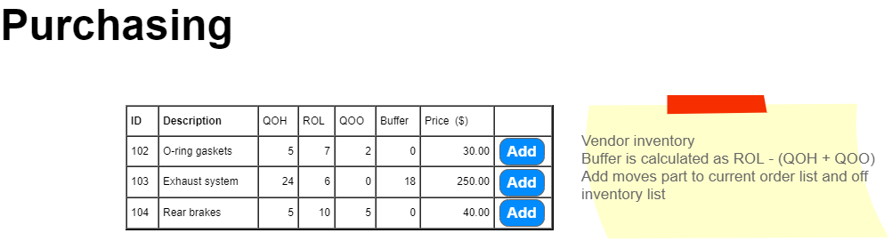

# Introduction to Purchase Orders

In this module, we will explore the concept of Purchase Orders (POs) within business processing systems. This introduction is designed to help you understand what a purchase order is, how it functions within a business's purchasing subsystem, and the roles involved in creating and managing purchase orders.

## What is a Purchase Order?

A Purchase Order is an official document issued by a buyer committing to pay the seller for the sale of specific products or services to be delivered in the future. In business processing systems, POs play a critical role in controlling the purchasing of products and services from external suppliers.

# Expanded Overview of Purchase Orders

A Purchase Order (PO) is a critical document in business transactions, acting as a legally binding agreement between a buyer and a seller. It outlines the types, quantities, and agreed prices for products or services. POs help businesses manage their purchasing processes, ensure clear communication with suppliers, and maintain financial control.

## Historical Context

The concept of purchase orders has been around since the late 19th and early 20th centuries, evolving with the rise of industrialization and complex business operations. Initially, businesses conducted transactions based on verbal agreements or simple written correspondence. However, as companies grew and operations became more complex, the need for formalized procurement processes became evident. The purchase order system was developed to meet this need, providing a structured method for businesses to order goods and services while maintaining records of their purchases.

## Importance of Purchase Orders

Purchase orders serve several critical functions in business operations:

- **Legal Protection**: POs provide legal clarity and protection for both the buyer and the seller. For the buyer, it ensures the seller delivers the products or services as agreed. For the seller, it guarantees payment for those products or services.
- **Financial Management**: They allow businesses to track expenditures, manage budgets, and forecast financial commitments.
- **Order Accuracy**: POs help ensure that orders are filled accurately, as they detail the exact specifications and quantities of the products or services ordered.
- **Record Keeping**: They serve as an official record of transactions, aiding in inventory management, accounting, and auditing processes.

## High-Level Rules for Using Purchase Orders

When implementing and using purchase orders, organizations typically adhere to a set of high-level rules to ensure efficiency, compliance, and accountability:

1. **Authorization**: Only authorized personnel should have the ability to issue purchase orders. This control helps prevent unauthorized spending and ensures that purchases align with company budgets and policies.
2. **Budget Compliance**: Purchases must be checked against available budgets before issuing a PO. This step ensures that the organization does not commit to spending beyond its means.
3. **Vendor Verification**: Organizations should conduct due diligence on vendors to ensure they are reputable, reliable, and capable of fulfilling orders as agreed. This process might include checking references, reviewing financial stability, and evaluating past performance.
4. **Clear Specifications**: POs should clearly specify the products or services being ordered, including quantities, prices, delivery dates, and payment terms. This clarity prevents disputes and misunderstandings.
5. **Sequential Tracking**: POs are typically numbered sequentially, providing an easy way to track and reference orders. This system aids in record-keeping and financial tracking.
6. **Review and Approval Process**: Before issuance, POs should go through a review and approval process. This step ensures that the order is accurate, necessary, and within budgetary constraints.
7. **Change Management**: Any changes to a purchase order should be documented and approved through a formal amendment process. This rule helps maintain the integrity of the original agreement and legal protections.
8. **Receiving and Inspection**: Upon receipt of goods or services, a process should be in place to inspect and verify that what was delivered matches the PO. This step is crucial for quality control and for validating payment to the vendor.

By adhering to these rules, organizations can leverage purchase orders as effective tools for managing their purchasing needs, ensuring financial discipline, and fostering strong relationships with vendors.

### Key Concepts

- **Authentication**: Employees must log onto the system to access the purchasing subsystem. Only authenticated users with the Purchasing Role can create and manage purchase orders.
- **Creation**: A Parts Manager typically initiates the creation of a purchase order.
- **Vendor Selection**: Each purchase order is associated with a specific vendor. The system ensures that a vendor may have only one active order (not yet placed) at a time.

### The Process of Creating a Purchase Order

1. **Login and Authentication**
   Employees log onto the system and must be authenticated as part of the Purchasing Role to access the purchasing subsystem.

2. **Initiation**
   A purchase order can be initiated in two ways:
   - Generating a suggested purchase order list for a new order.
   - Retrieving and displaying an active but not yet placed order for a vendor.

3. **Suggested Purchase Order**
   If a vendor does not have an active order, the system can suggest a new order based on inventory needs. This suggested list can be adjusted by the manager before becoming an active order.

4. **Active Order Management**
   An active order is one that is being considered but has not yet been placed. Managers can adjust the order by adding, removing, or modifying items.

5. **Placing the Order**
   Once finalized, the order is placed, updating the order date and the inventory's QuantityOnOrder. After placement, the order cannot be altered.

### Business Rules and Form Processing

- Each vendor can have zero or one active purchase order.
- An active purchase order has a NULL OrderDate.
- The system facilitates the addition, removal, and adjustment of items in the purchase order through a user interface.

### User Interface Components

- **Vendor Selection**: A dropdown to select vendors.
- **Order Management Buttons**: For actions like generating a suggested order, updating an active order, placing the order, and clearing the form.
- **Inventory and Order Details**: Displays for managing the items on the order and viewing current inventory.

### Visual Aids

- Diagrams and ERDs (Entity-Relationship Diagrams) may supplement these specifications to illustrate the transactional processing involved in purchasing.

*For detailed instructions and further information, refer back to the [Purchasing](./ReadMe.md).*

---

This overview provides a foundational understanding of purchase orders within a business processing system, tailored for students new to the concept. As we progress, we'll delve deeper into each component and its role in efficient business operations.
