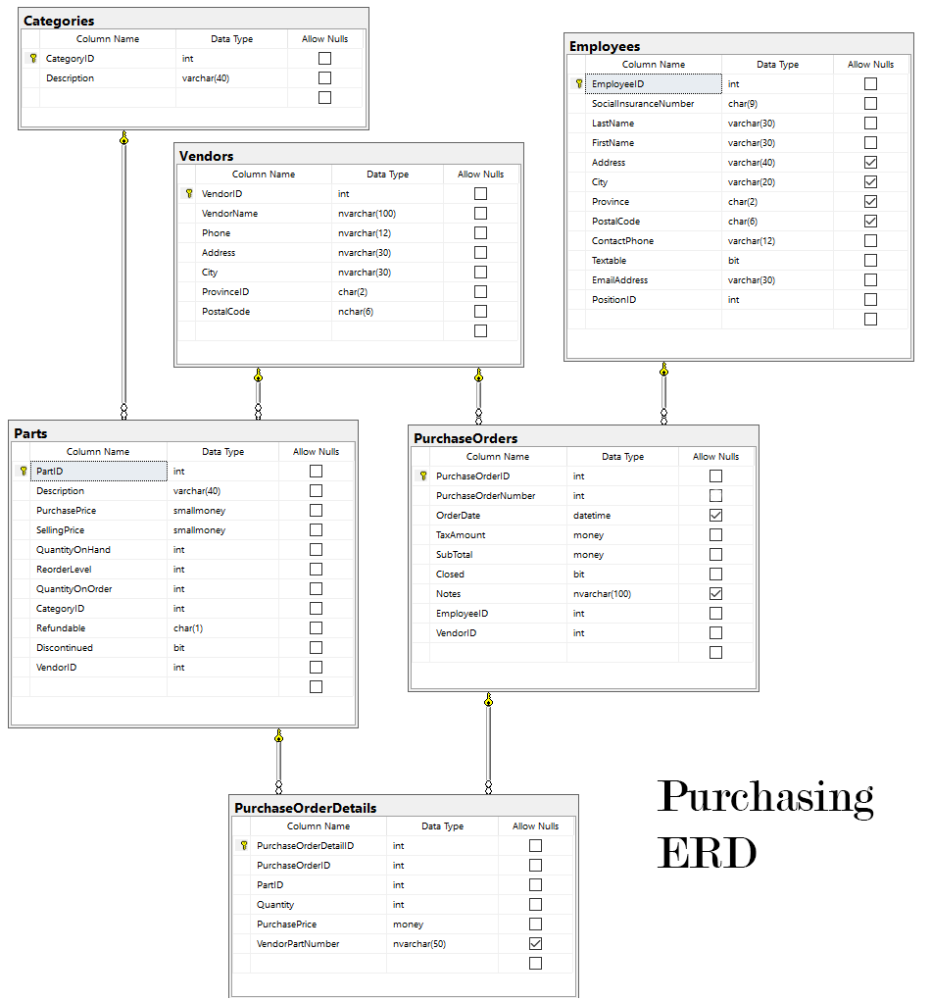
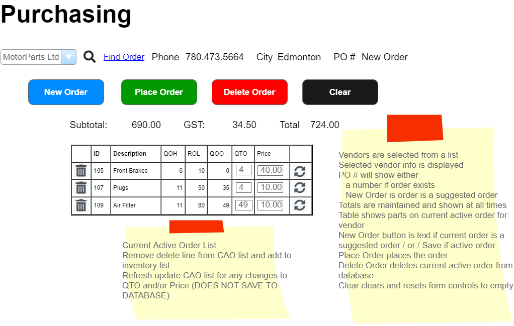
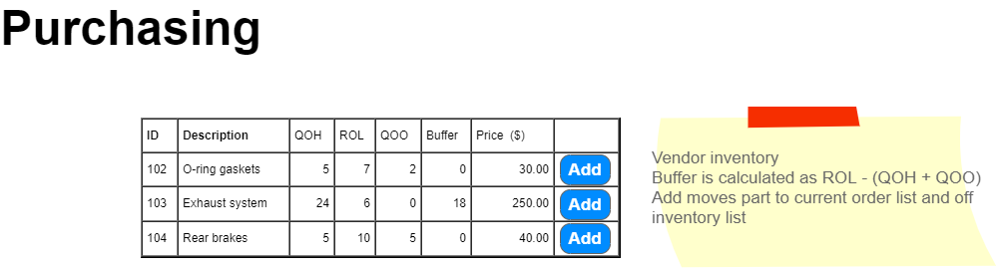

# Purchasing

> **NOTE:** These specifications may be supplemented by your instructor with sequence and/or class diagrams for the use cases involving transactional processing. When provided, you must follow the guidance of those diagrams.

## Create Purchase Order

### Business Process Overview

> *Employees must log onto the system. Purchasing must only allow authenticated users within the Purchasing Role to have access to the subsystem. A Parts Manager creates purchases. The Employee full name must appear on the form in text mode*

Purchases are to a specific vendor. A vendor may have or may not have a purchase order currently active that is not yet placed. A purchase order that is currently active but not yet placed will have a null Order Date on the database record. An order may be created over several work sessions until a decision is made to actually place (send the order) to the vendor. A vendor may have only one active order on file at a time. Purchase processing starts by either:  
  
- requesting a suggested purchase order list for a new order, or
- retrieving and displaying the currently active but not placed vendor order.  

### Suggested Purchase Order

A suggested purchase order is created when the vendor does **not** have a current active order (an order that has been started, is being reviewed and adjusted and is **not** placed). The system compares inventory reorder levels against quantity on hand and outstanding purchase orders quantities not yet received for a specific vendor part. This data is displayed for the manager so that the manager may make any alternations to the suggested order list. The manager may add items to the suggested order list, adjust existing data on the list and remove items from the list. A current active order is created (a PurchaseOrder record and PurchaseOrderDetail records) from this list when the **Update** button is pressed, **not before**. When the new current active order is created, the PurchaseOrderNumber (PON) will be auto-generated by the program.The new PON will be the next highest PON on file. This will become the Current Active Order for the vendor.

### Current Active Order

A current active order is an existing order which has not yet been **placed**. This is an order that contains items that are being considered for purchasing from the vendor. The manager may make any alternations to this order by adding more items, adjusting quantity and price for items, and removing items from the order list. An current active order is identified by **not** having an Order Date.

### Placed Order

Once the manager is satisfied with the purchase order, the purchase order is placed. When the order is placed, the Order Date is filled with the current date. The part's QuantityOnOrder will be updated at this time. This purchase order **can no longer be altered.**

### Requirements

Business Rules and Form Processing

- Each vendor can have zero or one "currently open" purchase orders (PO).
- A "currently open" purchase order is one where the OrderDate is NULL
- Current Purchase Order (PO) display will hold the current purchase order detail items
- Current Inventory will hold the stock items of the vendor that are **not** on the current order.
- Form Requirements and Usage:
  - Vendor Area: A drop-down listing current vendors. Drop-down has [Select a Vendor] as the first item. Total areas are set to zero. Vendor address area is empty
  - A button beside the Vendor Drop-down will cause either:  
    - (a)  
      - a new suggested order to be generated based upon suggested order criteria and displayed (no current active order exists)
      - display of vendor stock items not on the suggested order
      - a Part item is considered a candidate for ordering when ReorderLevel - (QuantityOnHand + QuantityOnOrder) > 0
      - this list will become a current order **if** the Update button is pressed 
    - (b)  
      - the current active open order to be retrieved and displayed
      - the PO may or maynot have any details as it is a work in progress
      - display of vendor part items not on the current open order
      - current order is open until a **place order** is clicked
    - Vendor information is to be displayed
  - Control command buttons
    - Purchase Order Action - Remove Item
      - Remove the line item from the Purchase Order display
      - Refresh the page
      - there is no change to the database
    - Purchase Order Action - Refresh Item
      - refresh the line item on the Purchase Order display (due to qunatity or price alternation)
      - Refresh the page
      - there is no change to the database
    - Current Inventory Action - Add to Order
      - Add the line item to the Purchase Order display
      - An inventory item can appear **only once** on the purchase order list.
      - Refresh the page
      - there is no change to the database
  - Form Process Buttons
    - Update Order 
      - will do a bulk update processing of the currently displayed purchase order
      - will cause a suggested order to be saved to the database **for the first time** becoming a current active order
      - saving a suggested order will generate the Purchase Order Number.
    - Place Order 
      - ensure the current display has updated the current active order on the database 
      - will set the OrderDate for the current order 
      - update the QuantityOnOrder for each stock item on the purchase order
      - issue a confirmation dialog informing the user the order will no longer be able to be altered.
    - Delete Order 
      - will delete the current open purchase order and purchase order details from the system. A Placed Order cannot be deleted.
      - issue a confirmation dialog informing the user the order will be removed from the database permanently
    - Clear 
      - will clear the web page of the current purchase order and reset the vendor list to the vendor prompt line
      - issue a confirmation dialog informing the user the order display will be cleared and any unsaved changes will be lost.

*Back to the [General Instructions](./../README.md)*
