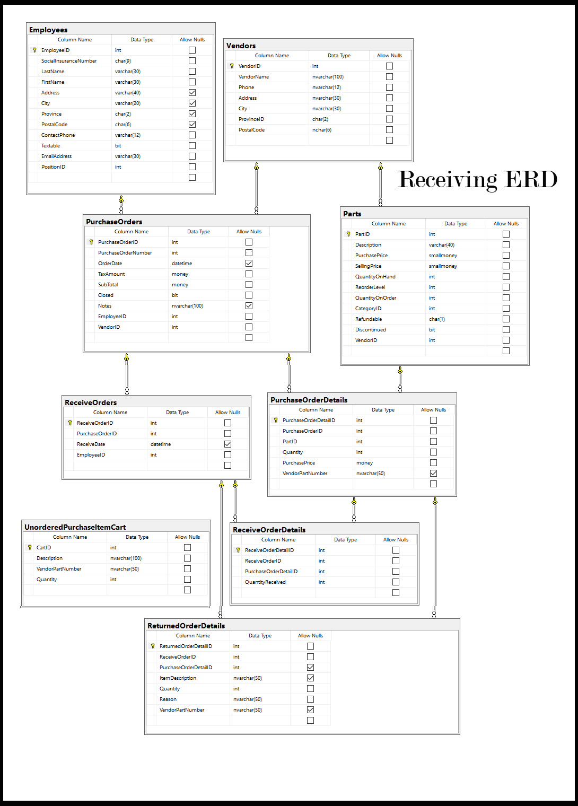
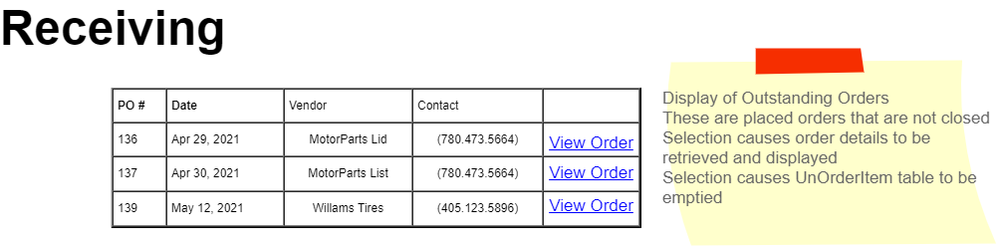
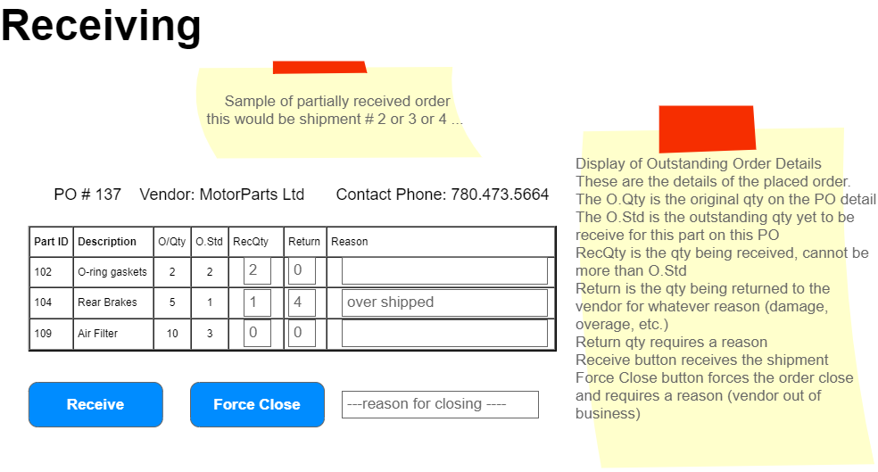
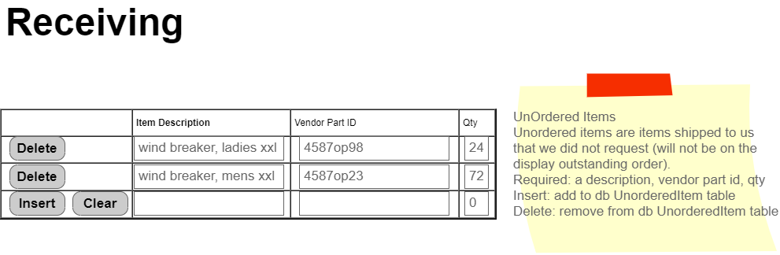

# Introduction to Receiving Purchase Orders

In this section, we'll explore the process of receiving purchase orders, a critical step in business processing that ensures the accurate fulfillment of orders. Understanding this process is essential for managing inventory, maintaining accurate financial records, and ensuring business operations run smoothly.

## Business Process Overview

> **NOTE:** These specifications may be supplemented by your instructor with sequence and/or class diagrams for the use cases involving transactional processing. When provided, you must follow the guidance of those diagrams.

Receiving involves the manual verification of items shipped by the vendor against the shipping sheet and the original purchase order. This process is crucial for ensuring that the business receives exactly what was ordered, in the correct quantities, and in good condition.

### Key Steps in the Receiving Process

1. **Authentication and Role Access**: Only authenticated users with the Receiving Role can access the receiving subsystem. This ensures that only authorized personnel handle the receiving process.

2. **Verification**: The receiver compares the items and quantities received against the shipping sheet and the original purchase order. This step is vital for identifying any discrepancies, such as missing items or items shipped in error.

3. **Recording**: The receiver documents the quantity of items received, any items refused and returned, and any items sent by accident that were not on the original purchase order.

4. **Processing**: After verification and recording, the receiver processes the data for bulk updating in the system. This includes updating inventory levels and adjusting the status of the purchase order.

### Detailed Steps and Requirements

- **Selection of Order**: The receiver selects an outstanding order from a displayed list to begin the receiving process.
  
- **Order Verification**: Upon selecting an order, its details are displayed for manual verification against the shipping sheet.
  
- **Data Entry**: The receiver enters data regarding received and returned items, including reasons for any returns.
  
- **Handling Unordered Items**: Items not on the original order but shipped by the vendor are processed separately, ensuring accurate inventory and financial records.

- **Bulk Processing**: The system updates based on the receiver's entries, adjusting inventory levels and the status of the purchase order.

- **Force Close Option**: In certain situations, an order can be forcibly closed, such as when the supplier is unable to fulfill the order. A reason must be provided for this action.

## Business Rules and Form Processing

- **Single Order Processing**: Only one order is processed at a time, focusing on outstanding orders that have not been closed and have an order date.

- **Display and Entry Requirements**: Specific information must be displayed for each order, and the receiver must enter data for received and returned items accurately.

- **Temporary Cart for Unordered Items**: A temporary cart collects records of unordered items for processing. This cart is emptied after each receiving session.

- **Control and Process Buttons**: The system provides buttons for viewing order details, receiving orders, force closing orders, and managing unordered items.

## Visual Aids

- **Receiving ERD**: Provides a visual representation of the database structure related to receiving.
  
- **Screenshots**: Include images of the outstanding orders list, order details, and the process for handling unordered items.

*Back to the [Receiving](./ReadMe.md)*

---

This introduction aims to demystify the process of receiving purchase orders, highlighting the importance of accuracy, documentation, and system updates in business processing. Understanding these steps ensures that students are well-prepared to manage this critical aspect of business operations effectively.
