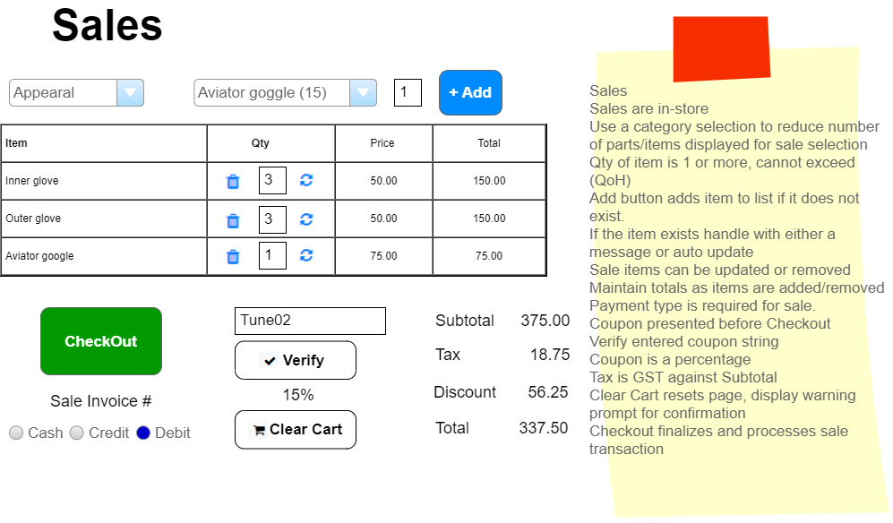
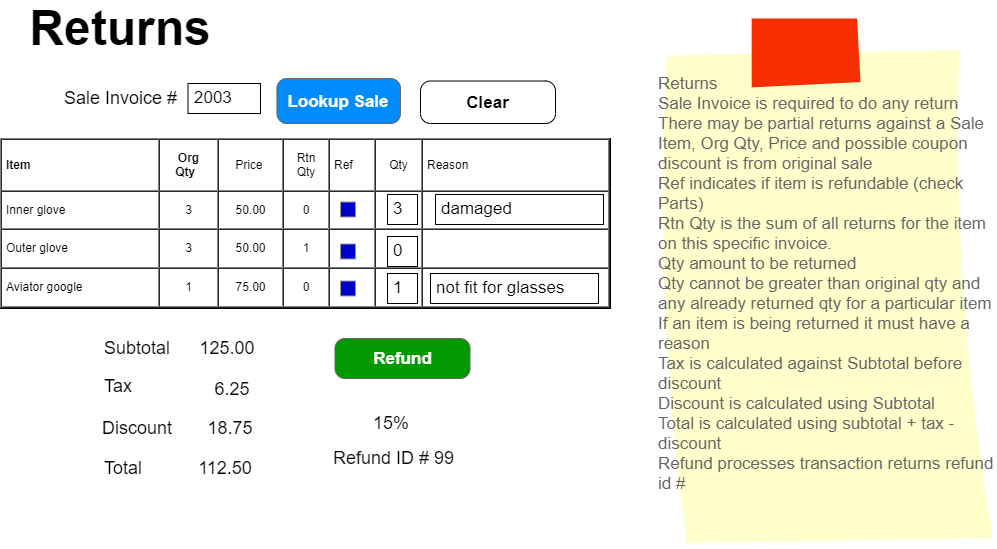
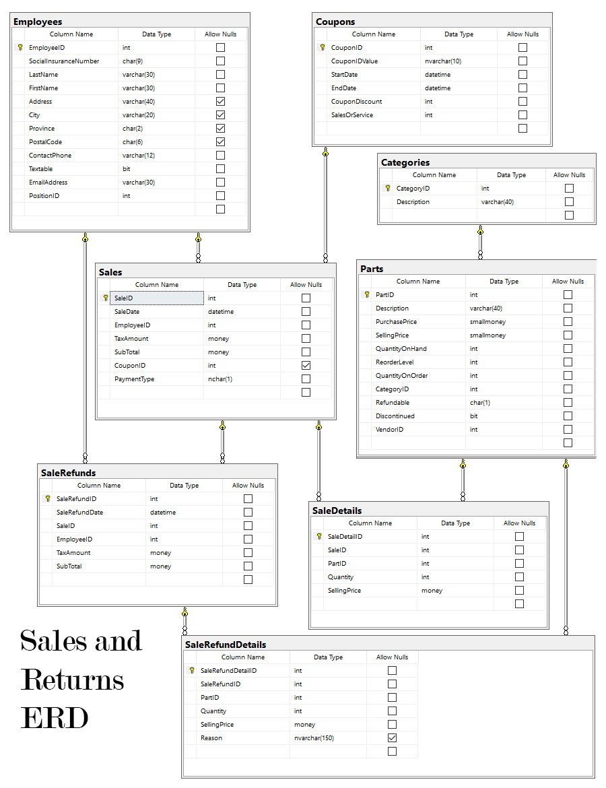

# Introduction to Sales and Sales Returns

In this module, we'll delve into the Sales and Returns subsystem, focusing on in-store events. This overview is designed to help students understand the processes involved in sales and handling returns, crucial components of business operations.

## Business Process Overview

> **NOTE:** These specifications may be supplemented by your instructor with sequence and/or class diagrams for the use cases involving transactional processing. When provided, you must follow the guidance of those diagrams.

The Sales/Returns subsystem is integral for managing in-store sales of products and processing refunds, ensuring that transactions are accurately recorded and inventory is properly managed.

## Sales

### In-Store Shopping

Customers select products/parts for purchase, which are then recorded in a sales cart linked to the employee's till. The system allows for the addition and removal of items, and quantities can be adjusted within the sales cart. A crucial step is the application of discounts (if any) before finalizing the sale.

#### Business Rules and Form Processing: Sales

- Each sale is limited to **one** shopping cart.
- Duplicate items in the cart are **not** allowed.
- Discontinued products are not available for sale.
- Sales involve various steps, including item addition, quantity adjustments, coupon verification, and payment processing.
- **Qty on sales cannot be negative.** Ensuring that the quantity of items sold is always a positive number.
- The **CheckOut** button finalizes the sale, updating inventory and sales records.

## Refunds/Returns

Customers can return items for a refund, given they have the original receipt and provide a reason for each returned item. The system allows for partial returns and ensures that the quantity returned does not exceed the quantity originally sold.

### Business Rules and Form Processing: Refunds

- Refunds are processed based on the original sale receipt.
- **Qty return cannot be greater than the total qty on the sales less any returns done in the past.**
- **Qty cannot be negative for returns.** This ensures that returns are always for a positive quantity of items.
- A successful refund generates a SalesRefund record, adjusting inventory accordingly.
- The refund process is completed as a single transaction, ensuring accuracy and integrity of the sales and inventory records.

## Visual Aids

- **Sales and Returns ERD**: Provides a visual representation of the database structure related to sales and returns.

*Back to the [General Instructions](./README.md)*

---

This introduction aims to provide students with a foundational understanding of sales and sales returns within a business setting, emphasizing the importance of accurate transaction processing and inventory management.
