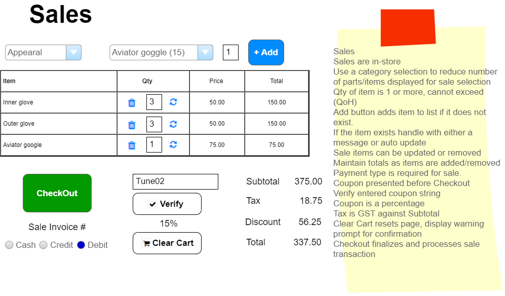
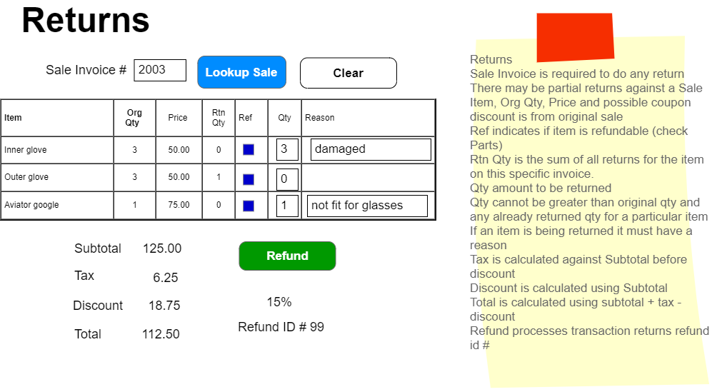
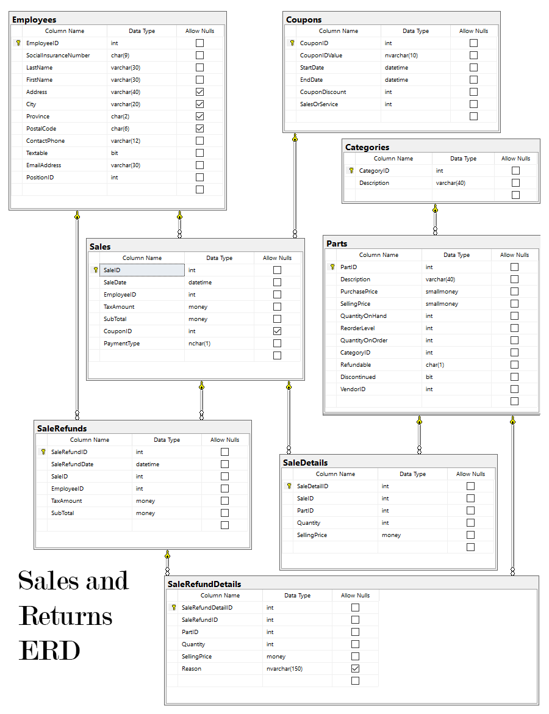

# Sales

> **NOTE:** These specifications may be supplemented by your instructor with sequence and/or class diagrams for the use cases involving transactional processing. When provided, you must follow the guidance of those diagrams.

## Business Process Overview

> *The Sales and Returns component assigned to you is for supporting in store events only. Employees must log onto the system. Sales and Returns must only allow authenticated users within the SalesReturns Role to have access to the subsystem. A store staff or Sales Manager handle sales and/or returns. The Employee full name must appear on the form in text mode*

## Sales

The Sales/Returns subsystem handles all in-store sales of products as well as refunds. 

### In-Store Shopping

Customers bring products/parts to the counter for in-store purchases. If the product/part is kept in the back of the store, the customer approaches the counter and gets the employee to retrieve the product/part.  The employee records each item in a sales cart dedicated to the employee's till. Items can be added and removed from the sales cart and the quantities can be edited in the sales cart; refresh the item subtotals when the refresh icon is clicked (). The sale is checked for all valid input before the customer payment is requested. When the customer pays, the employee clicks the **CheckOut** button and the entire sales cart is updated and processed as a completed sale. A Clear Cart button must be present on all time to cancel the current shopping process the employee is handling. Any coupon needs to be presented and verified prior to the final sale. Discount is a **percentage** and is applied **only** against the subtotal. Taxes are applied to the sale **before** any discount.

## Business Rules and Form Processing : Sales

The following rules should be considered in the behavior of in-store sales.

- A sale is allowed to have only **one** shopping cart (but as many items in the cart as they want). 
- Duplicate items in the cart is **not** allowed. 
- Discontinued products should not be shown and cannot be added to the cart.
- Employees continue the cart entering process after adding an item
- Employee can change quantities and/or remove items from the cart
- Box to enter a coupon & button to verify (display discount if valid)
- Payment types are 'M', 'C', or 'D', for 'Money', 'Credit' and 'Debit', respectively
- Subtotal, GST (is calculated prior to any discount), Discount (is a calculated percentage i.e.: 10% on subtotal), and Total

- Add button
  - The quantity (which must be a whole number greater than zero) must be supplied when clicking Add
  - Quantity next to Add defaults to 1
  - Added products are added to the shopping cart items. If the item is already on the cart either:
    - a) display a message and reject the addition
    - b) auto update the quantity of the item already on the cart to current quantity + new quantity
  - Recalculate totals  
  
- CheckOut button
  - Placing the order is done as a complete transaction on the server (a single context.SaveChanges()). In this transaction, you must do the following:
    - Create a sale and sale items based on all the information in the shopping cart.
    - Reduce the quantity on hand based on the quantities of the items purchased. Ensure that the part quantity on hand will not go negative. Throw an exception if this will happen.
    - Display the sales id.
    - Items cannot be added or edited after the payment is processed.

- Clear Cart button
  - Reset form
  - Empty part list
  - Set add quantity to 1
  - Clear coupon
  - Zero totals

- Verify button
  - Check entered coupon to be valid: exists and date check activity
  - Display percentage
  - Recalculate totals with discount applied
  - Discount is applied **only** to subtotal
  

## Refunds/Returns

Customer may bring items back for a refund, provided that they show their original receipt and that they give a reason for each item refunded. Partial returns are allowed for the sale. The employee will enter the sale receipt number and display the original sale. The employee will check to see if the number of items being returned exceeds the original quantity sold. Items of separate sale **cannot** be combined. There **must** be a reason supplied for the refund per item. Non-Refundable item will not be refunded.

## Business Rules and Form Processing: Refunds

Use the following rules when processing returns.

- Refunds require the original receipt number (SaleID) in order to be processed.
- A successful refund results in a SalesRefund record and at least one SalesRefundDetail record being generated.
- Individual item refunds are allowed. Partial item refunds are allowed. You may not return more item quantity then were sold on the original sale for particular item.
- The refunded price is the price on the original sale.
- If a discount was applied to the original sale then the discount applies to the subtotal funds returned to the purchaser (Tax is not discounted).
- The refund process is to happen as a single complete transaction.
  - The refund results are to remain on the screen after the refund is complete. Show the Sale Refund number of the refund.
  - The refund cannot be edited after it has been processed.
  - In-stock inventory quantities need to be updated with all refunds, but the product itself is set aside for later inspection by a manager (who may return it to the supplier in a separate process).

- Clicking the **Clear** button clears the screen

----

*Back to the [General Instructions](./../README.md)*
