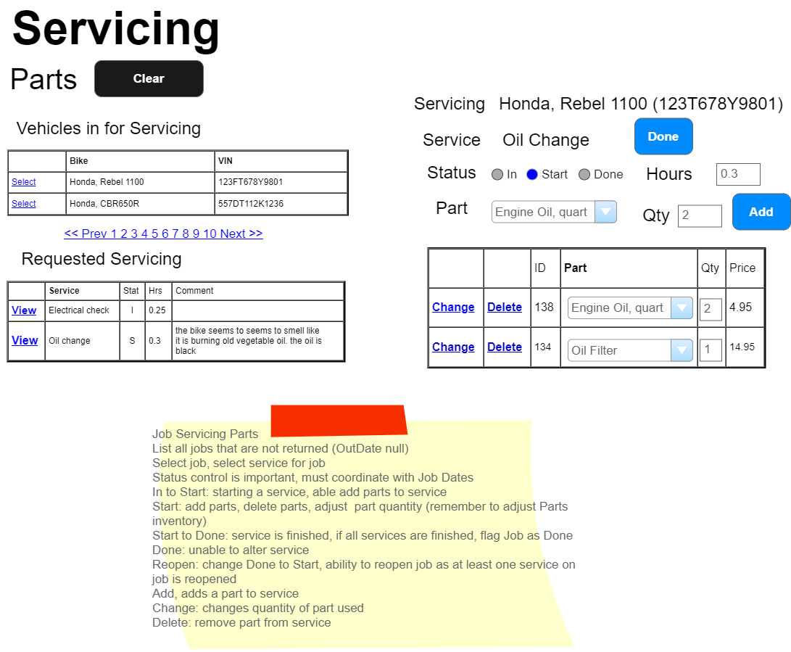

# Introduction to Servicing

In this module, we'll explore the Servicing component, focusing exclusively on in-shop servicing events. This overview aims to help students understand the processes involved in servicing, a crucial component of business operations, especially in contexts involving vehicle maintenance.

## Business Process Overview

> **NOTE:** These specifications may be supplemented by your instructor with sequence and/or class diagrams for the use cases involving transactional processing. When provided, you must follow the guidance of those diagrams.

The Servicing subsystem is designed to manage the registration of servicing jobs and the assignment of parts to those jobs, ensuring that vehicles are properly maintained and serviced.

## Job Registration

### Registration Process

Customers bring their vehicles to the service department for check-in. The service desk, manned by a mechanic or shop manager, handles the check-in process, selecting the vehicle for service from the customer's profile. Each job is unique to one vehicle and may comprise multiple service items.

#### Business Rules and Form Processing: Job Registration

- **One Vehicle per Job**: Each servicing job is specific to a single vehicle.
- **Service Items**: A job can include multiple service items, such as oil changes or tune-ups.
- **Customer Comments**: Optional comments can be added for each service item.
- **Service List Management**: Services can be added, removed, or cleared from the job list before registration.
- **Coupon Verification**: Discounts, applied as a percentage, can be verified and applied to a service.

### Key Actions in the Registration Process

- **Customer and Vehicle Lookup**: Employees can search for customers by last name and select vehicles associated with the customer.
- **Service Assignment**: Standard services can be assigned to a job, with the ability to specify service descriptions and estimated hours.
- **Discount Application**: Coupons, once verified, apply a discount to the service cost.
- **Form Management**: Services can be added to the job list, with options to reset the current service input or remove a service from the list.

### Form Buttons and Their Functions

- **Add Button**: Adds a service to the job list, requiring a service description and estimated hours.
- **Reset Service Button**: Clears the current service input fields.
- **Remove Service Button**: Allows for the removal of a service from the job list before the job is registered.
- **Clear Cart Button**: Resets the entire form, clearing all input fields and lists.

<!-- NOTE: Set as a 5th scenario
## Service Parts

This section would detail the process for mechanics to enter parts used during a service, ensuring the parts inventory remains accurate and up-to-date. Mechanics can adjust part quantities and service hours as needed, with specific rules governing when parts can be added or adjusted.

## Business Rules and Form Processing: Servicing Parts

### Key Rules for Servicing Parts

- **Service Status**: Parts can only be added or adjusted when a service is in the "Start" status.
- **Inventory Management**: Adjustments to part quantities directly update the parts inventory.
- **Service Reopening**: A service can be reopened for adjustments if necessary.

-->

----

*Back to the [General Instructions](./ReadMe.md)*

---

This introduction provides a foundational understanding of the servicing process within a business setting, emphasizing the importance of accurate job registration, service item management, and customer interaction.
