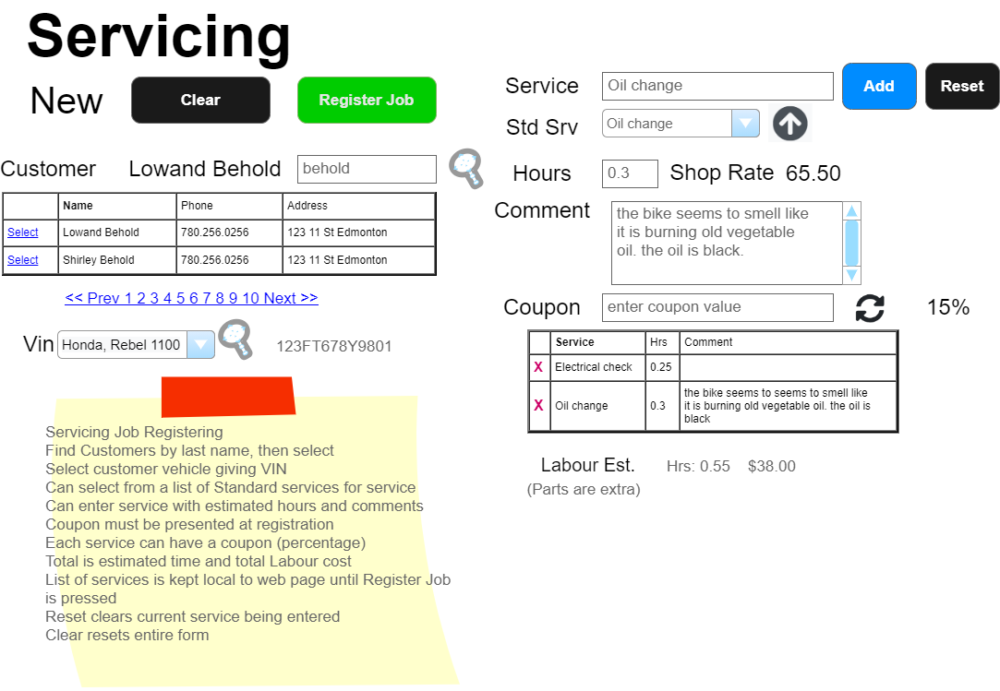
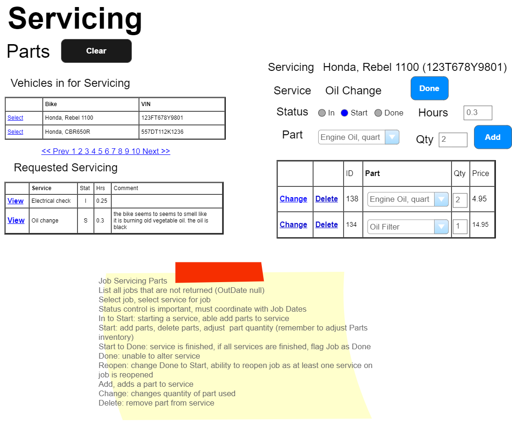
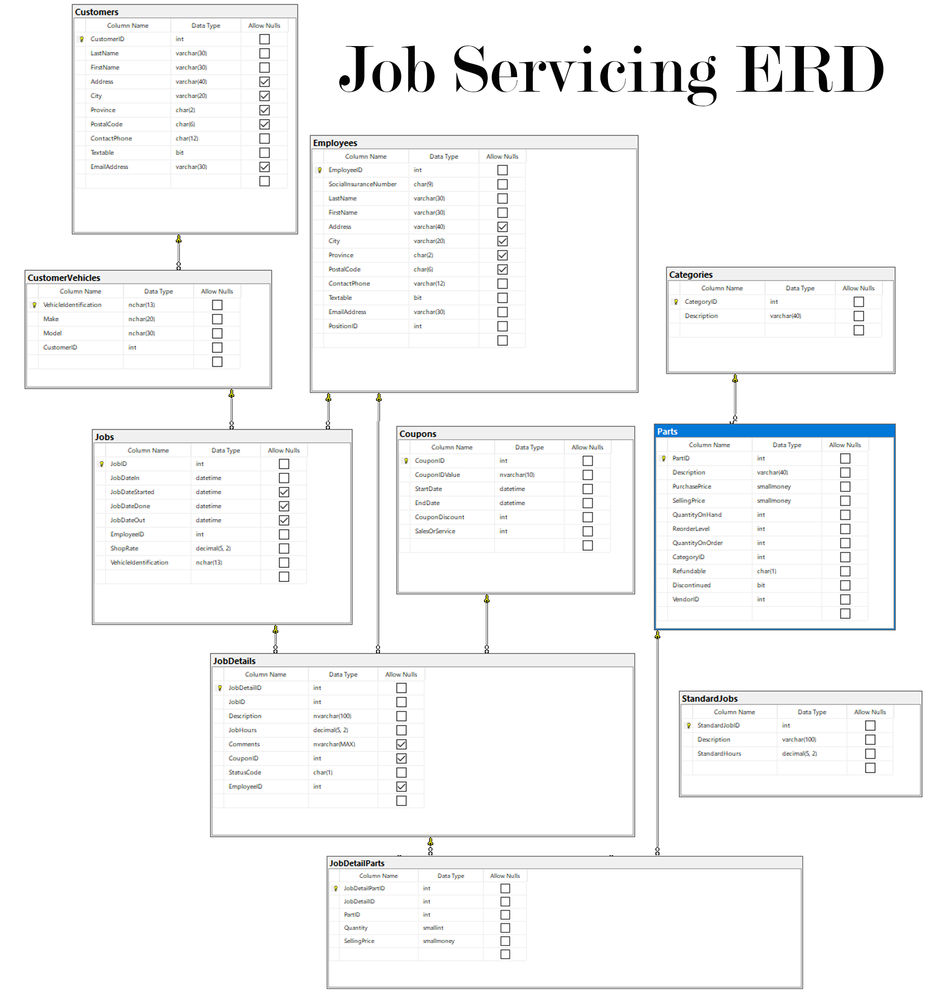

# Servicing

> **NOTE:** These specifications may be supplemented by your instructor with sequence and/or class diagrams for the use cases involving transactional processing. When provided, you must follow the guidance of those diagrams.

## Business Process Overview

> *The Servicing component assigned to you is for supporting in shop servicing events only. Employees must log onto the system. Servicing must only allow authenticated users within the Servicing Role to have access to the subsystem. A shop mechanic or Shop Manager handle job registration and/or part assignment. The Employee full name must appear on the form in text mode*

## Job registration

The Servicing subsystem handles the registration of a servicing job and the assignment of parts to/from from job. 

### Registration

Customers bring their bikes to the service department to check them in for servicing. The mechanic/shop manager at the servicing desk checks in the bike. The customer is retrieved along with a list of bikes for that customer (this information is added to the database via a separate system). The employee will select a bike for serving. A job is for only one vehicle. A servicing job may contain several service items. Required servicing is entered along the the estimated hours. A list of standard services is available from which to select. The employee registering the job can also add customer comments. Pressing the Add button adds the service to a list. A service can also be removed from the job before it is registered. An estimated labour charge is continuously updated. A Clear button must be present at all time to cancel the current registering process the employee is handling. A Service Reset button clears only the current service. Any coupon needs to be presented and verified prior to the registration is complete. Discount is a **percentage**. The discount is applied to a service.

## Business Rules and Form Processing : Job Registration

The following rules should be considered in the behavior of in-store sales.

- A job is applied to only **one** vehicle.
- A vehicle may have a history of servicing jobs.  
- A single job many have several separate services such as Fluid Flush, Oil Change, tune up, etc. 
- Customer comments for a service is optional.
- Each added service has a message is shown confirming that the service has been added to the job.
- Employee can clear the entire job before it is registered.
- Employee can clear a service before it is added.
- Employee can remove a service after it is added but before it is registered.
- Box to enter a coupon & button to verify (display discount if valid)
- A labour estimate is calculated against the current shop rate.

- Query buttons
  - Customer lookup by last name
    - Display a list of customers with partial last name match
    - Customer selection shows a list of associated customer bikes.
  - Vehicle selection
    - Display unique vehicle VIN (Vehicle Identification Number)
  - Assigning a standard job
    - Service description is filled
    - Hours is filled
  - Verifying coupon
    - Check entered coupon to be valid: exists and date check activity
    - Display percentage
   
- Add button
  - Service description must be supplied when clicking Add
  - Service hours must be supplied when clicking Add
  - Added service are placed on the servicing list. This list a form only list and **not** placed onto the database.  
  
- Reset Service button
  - Clears current service.
  - **Does not** clear the service list or entire form.

- Remove service (X) button
  - Removes a service from the form only list.
  - Must be done before the job is registered.
  - 

- Clear Cart button
  - Reset form
  - Empty service list
  - Empty VIN list
  - Empty customer list
  - Clear coupon, service description, hours, comments
  - Zero totals

<!-- NOTE: Set as a 5th scenario
## Service Parts

The mechanics in the shop have terminals to enter parts needed for any service. This helps keeping our Parts inventory current as the inventory also supplies parts to the store sales counter. As a mechanic works on a vehicle, the current information of the job is displayed on a single screen. the mechanic will select the vehicle then the service for that vehicle. The mechanic will change the service status as they work on the vehicle from In to Start to Done. The hours for a service is the expected time and can be altered up to completion of the service. Parts are from the category Parts and Servicing. When a part is used in the service it is added (along with quantity) to the service. The quantity for the part can be adjusted as the servicing is happening. A part **cannot** be added unless the service has been **Started** and **cannot** be added or adjusted if the service is **Done**. A service can be **Reopened** if there is a change to the parts (added, removed, or quantity change) if the service has been closed (flagged as Done).

## Business Rules and Form Processing: Servicing Parts

Use the following rules when processing part servicing.

- Cannot add, remove or adjust part quantity unless service is in the Start status.

- As a part is added, removed or quantity adjusted, the Parts inventory **must** kept current.

- Only a part quantity may be adjusted by the mechanic.

- The job dates **must** kept current with the service status. If the job has multiple services, the job start date is set when the first service is started. The job is done when all services are done.

- A service can be reopened if flagged as done. Reopening a service will also reset the job done date if it has been set.

- The quantity for the parts **must** have sufficient amount in the store Parts inventory.

- Hours can be changed. However, the mechanic knows there are standard hours for a standard job whether the standard job takes more or less time. Example an oil change is 1/2 hour. Special services may be estimated but after the work is done, the hours may increased or decreased. The mechanic makes this change as the service is completed.

- Clicking the **Clear** button clears the screen
-->

----

*Back to the [General Instructions](./../README.md)*
